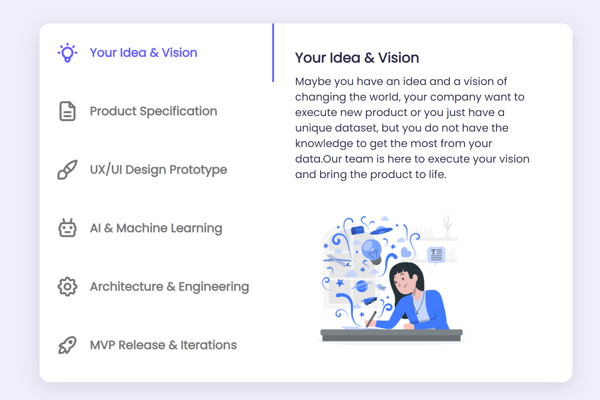

# Vinishireis - Vertical Tabs (Vinishireis)

A pen Created on Vinishireis

---
Vertical tabs are an alternative layout for organizing and navigating through content in a user interface. Unlike traditional horizontal tabs, which are aligned horizontally along the top or bottom of a window or container, vertical tabs are positioned vertically along one side, typically the left or right.

The main advantage of vertical tabs lies in their ability to conserve horizontal space, making them particularly useful in applications where screen real estate is limited or where users work with wide or horizontally-oriented content. By stacking tabs vertically, more tabs can be displayed without the need for horizontal scrolling, which can improve navigation efficiency and user experience, especially on smaller screens such as laptops or tablets.

Vertical tabs can be implemented in various ways depending on the design and requirements of the application. They can function similarly to horizontal tabs, allowing users to switch between different sections or views of the content by clicking on the respective tab. Additionally, vertical tabs may offer features such as drag-and-drop reordering, nested tabs for hierarchical organization, and collapsible or expandable sections to further optimize space and streamline navigation.

One common use case for vertical tabs is in web browsers, where they provide an alternative way to manage multiple open tabs. Instead of displaying tabs along the top of the browser window, users can opt for a vertical tab layout, which can be particularly beneficial for users who frequently work with a large number of tabs simultaneously.

In software development, frameworks and libraries often provide components or plugins to easily implement vertical tabs in web applications or desktop interfaces. These components typically offer customizable styles and behaviors to suit different design preferences and usability requirements.
---

